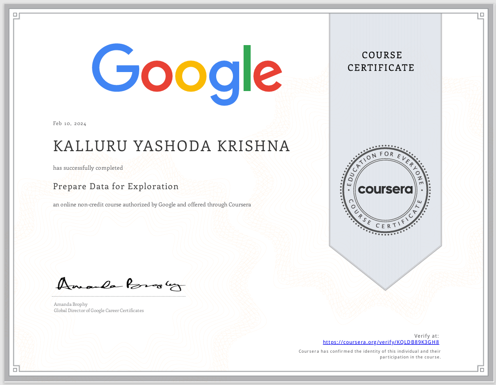
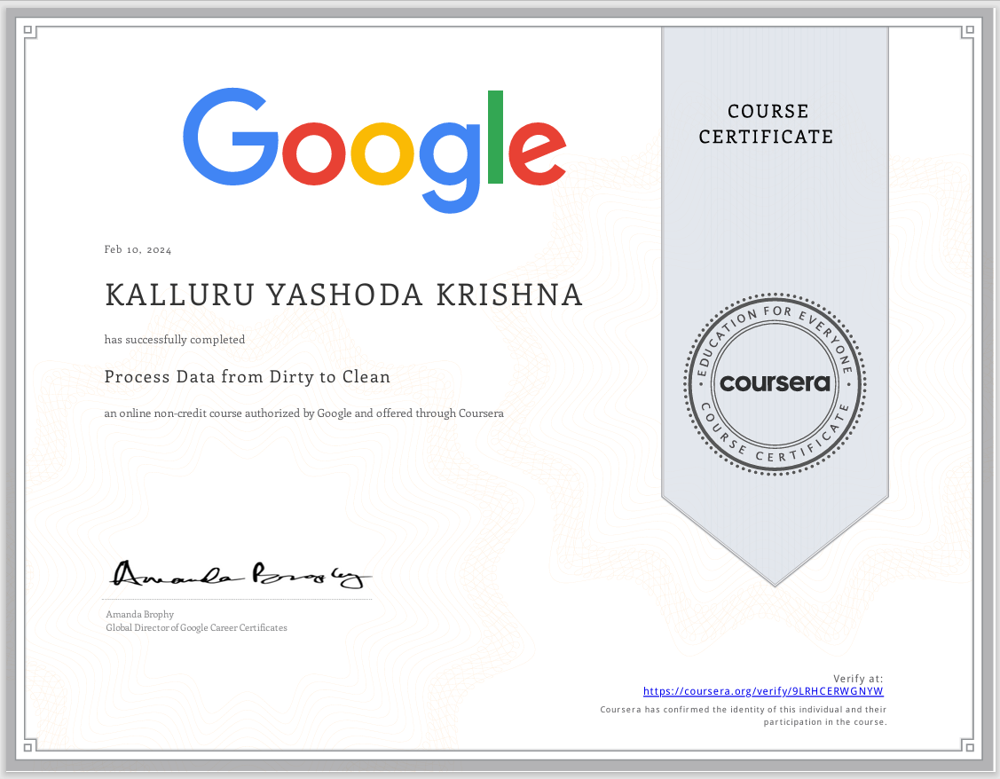
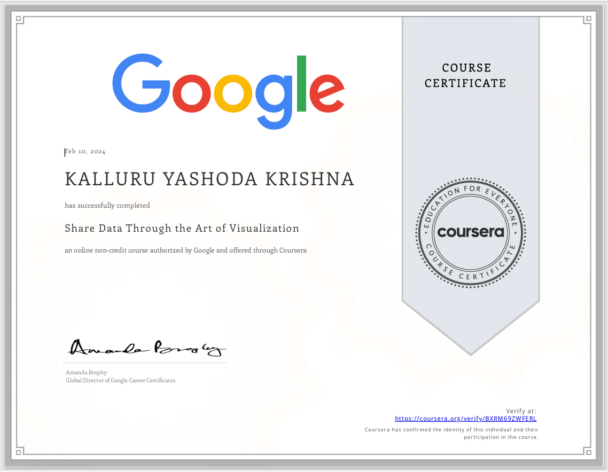

### Google Data Analytics Professional Certificate

### Foundations Data, Data, Everywhere

### Ask Questions to Make Data-Driven Decisions

### Prepare Data for Exploration

### Process Data from Dirty to Clean

### Analyze Data to Answer Questions

### Share Data Through the Art of Visualization

### Data Analysis with R Programming

### Google Data Analytics Capstone Complete a Case Study

