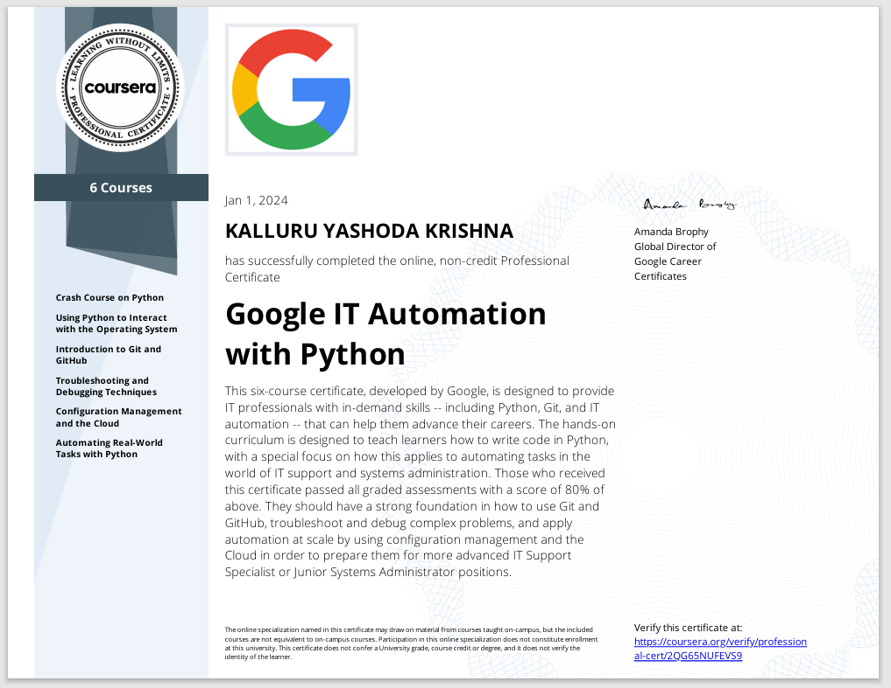
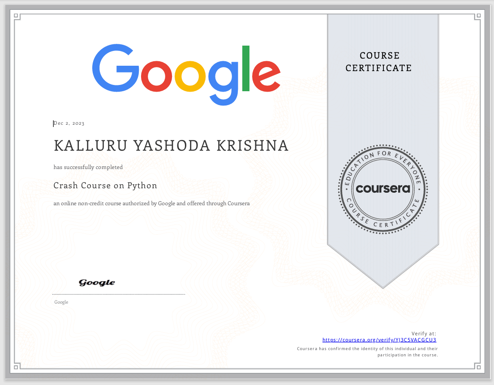
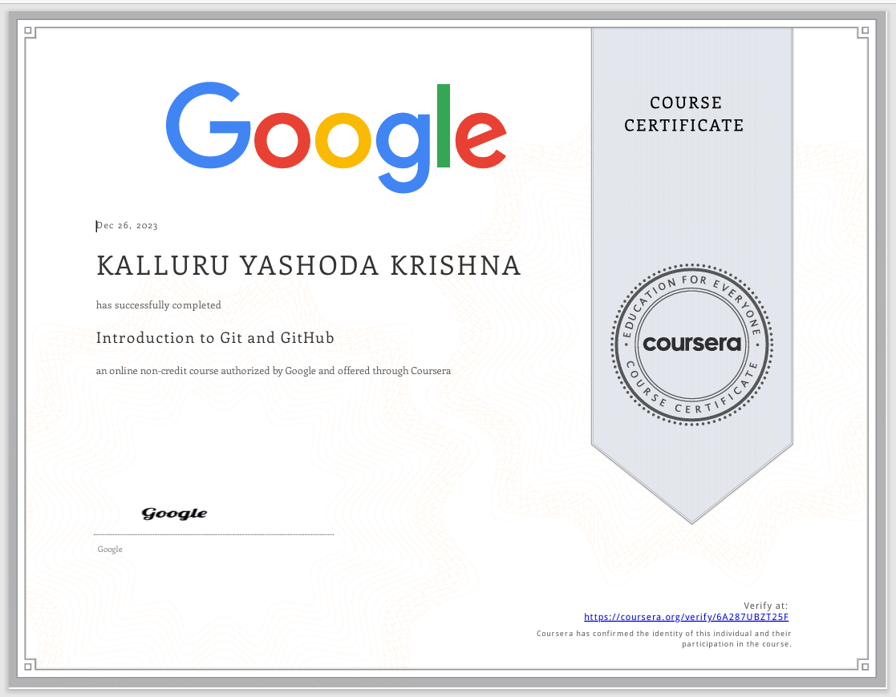
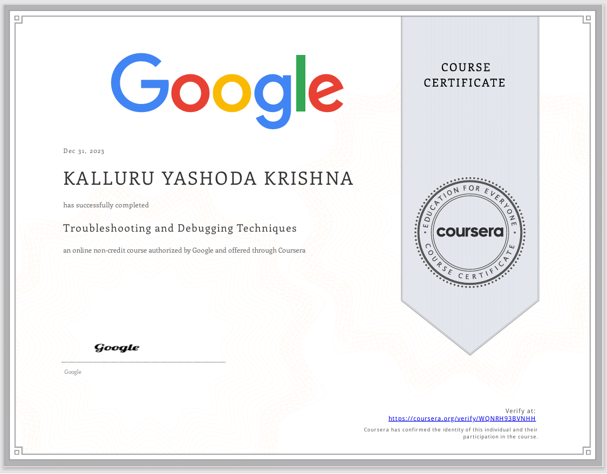

### Google IT Automation with Python

### Crash Course on Python

### Using Python to Interact with the Operating System

### Introduction to Git and GitHub.pdf

### Troubleshooting and Debugging Techniques

### Configuration Management and the Cloud

### Automating Real-World Tasks with Python.pdf

